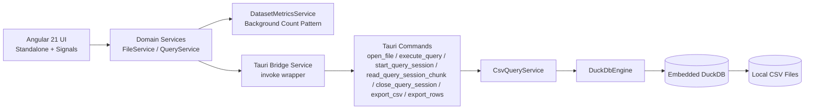

# Architecture: Tapir:Query

## 1. Scope and Goals

Tapir:Query is a desktop-only, local-first analytics tool for CSV exploration.

Primary goals:

- Fast local query iteration on large CSV files.
- Predictable memory behavior via pagination and virtualization.
- Strict boundaries between UI, orchestration, and execution layers.
- Explicit IPC contracts between Rust and TypeScript.

## 2. High-Level Runtime View



## 3. Backend Architecture (Rust + DuckDB)

Module layout:

```text
src-tauri/src/
  commands/
    csv_commands.rs
  domain/
    csv_query_service.rs
  engine/
    duckdb_engine.rs
    sql_builder.rs
    mod.rs
  error.rs
  lib.rs
```

Responsibilities:

- `commands`: Tauri command boundary and DTO entry points.
- `domain`: orchestration and registry ownership.
- `engine`: query execution abstraction and DuckDB implementation.
- `error`: typed `AppError` categories (`Validation`, `Io`, `Sql`, `State`).

Command execution model:

- Tauri command functions are async.
- Blocking work (DuckDB operations, CSV export writes, filesystem-heavy actions) is executed on the blocking runtime via `spawn_blocking`.
- Command handlers keep orchestration thin and delegate behavior to `CsvQueryService`/engine.

### 3.1 DuckDB Connection Strategy

`DuckDbEngine` opens an in-memory DuckDB `Connection` per operation.

- On each operation, active registered CSV views are re-registered into that connection context.
- This avoids cross-request connection reuse issues seen during incident debugging.

Session streaming state stores SQL + metadata rather than connection-bound temp table names.

### 3.2 Registration and Session Optimizations

- Registered CSV views are recreated per operation from the active registry map.
- Query sessions store normalized SQL, projected columns, and total rows.
- `read_query_session_chunk` pages directly from stored SQL (`LIMIT/OFFSET`) and preserves column ordering.
- `read_csv_auto` uses bounded inference sampling (`SAMPLE_SIZE=20000`) to reduce first-open overhead.

## 4. Frontend Architecture (Angular 21 + Signals)

Module layout:

```text
src/app/
  domain/
    dataset-metrics.service.ts
    file.service.ts
    query.service.ts
  infrastructure/
    layout-state.service.ts
    error-parsing.service.ts
    tauri-bridge.service.ts
    tauri-contracts.ts
    log.service.ts
    perf.service.ts
    theme.service.ts
  features/
    drag-drop/
    file-picker/
    sql-editor/
    data-table/
    schema-sidebar/
    cheat-sheet/
    query-error-panel/
    settings-panel/
  app.component.*
```

State model:

- `FileService` (Signals): current file path, table name, inferred schema.
- `QueryService` (Signals): SQL text, rows, columns, pagination cursor, parsed errors, query timing, history.
- `LayoutStateService` (Signals): empty/loaded mode, schema sidebar collapse state, cheat-sheet drawer state.
- `ThemeService` (Signals): active theme + settings panel state with localStorage persistence.

UI behavior:

- Empty mode supports CSV ingestion via `DragDropDirective` and native file picker (`@tauri-apps/plugin-dialog`).
- Loaded mode uses a four-zone layout: action bar, collapsible schema rail, data grid, status bar.
- Data table filter actions insert SQL filter templates through `SqlGeneratorService`.
- `DatasetMetricsService` resolves filtered and total row counts through low-priority `COUNT(*)` queries in browser test/runtime contexts; in Tauri runtime this path is disabled as an incident mitigation for WSL WebKit watchdog crashes.
- SQL errors are parsed into DTOs and rendered inline directly under the editor.
- Table rendering uses Angular CDK virtual scroll.

## 5. IPC Protocol and Contracts

Command surface:

- `open_file`
- `execute_query`
- `start_query_session`
- `read_query_session_chunk`
- `close_query_session`
- `export_csv`
- `export_rows`

### 5.1 Command-Level DTO Mapping (Rust ↔ TypeScript)

| Command         | Rust Request DTO                                   | TS Request Contract                        | Rust Response DTO                                                                     | TS Response Contract                                                             |
| :-------------- | :------------------------------------------------- | :----------------------------------------- | :------------------------------------------------------------------------------------ | :------------------------------------------------------------------------------- |
| `open_file`     | `OpenFileRequest { file_path }`                    | invoke payload `{ request: { filePath } }` | `OpenFileResponse { table_name, file_path, columns, default_query, file_size_bytes }` | `OpenFileResponse { tableName, filePath, columns, defaultQuery, fileSizeBytes }` |
| `execute_query` | `ExecuteQueryRequest { sql, limit, offset }`       | `ExecuteQueryRequest`                      | `QueryChunk`                                                                          | `QueryChunk`                                                                     |
| `export_csv`    | `ExportCsvRequest { sql, output_path }`            | `ExportCsvRequest`                         | `ExportCsvResponse`                                                                   | `ExportCsvResponse`                                                              |
| `export_rows`   | `ExportRowsRequest { output_path, columns, rows }` | `ExportRowsRequest`                        | `ExportCsvResponse`                                                                   | `ExportCsvResponse`                                                              |

### 5.2 Field Naming Rules

- Rust DTOs use snake_case fields.
- Rust DTOs apply `#[serde(rename_all = "camelCase")]`.
- TypeScript contracts are camelCase, matching serialized IPC payloads.

Example mapping:

- Rust `file_path` ↔ TypeScript `filePath`
- Rust `rows_written` ↔ TypeScript `rowsWritten`

### 5.3 Query Payload Characteristics

- Query result rows are serialized as string-or-null cell values.
- Pagination fields: `limit`, `offset`, `nextOffset`.
- Engine execution timing is returned as `elapsedMs`.
- Frontend currently uses a direct execute path for preview, execute, and sort interactions to maximize runtime reliability; session streaming is retained as a fallback-capable implementation but is not the default while incident-level hangs are being mitigated.
- Status-bar row totals are resolved asynchronously through separate background `COUNT(*)` requests after the main query render path.

## 6. Observability and Benchmarking

Frontend telemetry:

- `PerfService` tracks bootup, file load, query roundtrip, query engine, and grid render timings.
- Dashboard shows latest and average durations.

Backend telemetry:

- `tracing` + `tracing-subscriber` log command lifecycle and engine-level failures.

Diagnostics:

- `LogService` captures IPC errors, drag/drop handling, and state transition breadcrumbs.
- Runtime incident diagnostics correlated app exits with `WebKitWebProcess` watchdog crashes after backend query success on WSL.

## 7. Streaming and Memory Strategy

- CSVs are exposed to DuckDB as views (not eagerly loaded into frontend memory).
- Query results are page-based to keep IPC payload size bounded.
- Virtualized table rendering keeps DOM size stable for large result sets.

## 8. Desktop-Only Decision Record

Decision:

- Tapir:Query remains desktop-only (Linux and Windows distribution targets).

Consequences:

- Mobile-specific generated assets and icon folders are removed.
- Cleanup automation exists at `tapir-query/scripts/cleanup-desktop.sh`.
- Architecture and release process are optimized for desktop bundle outputs only.

## 9. Testing

Backend:

- Unit tests cover SQL builder and engine edge cases.
- Real-world fixture test validates execution against downloaded sample CSVs.

Frontend:

- Jest test suites for app shell flow, query service behavior, and data table behavior.

## 10. Release and Operational Readiness

- Manual release workflow: `.github/workflows/release.yml` (`workflow_dispatch`).
- Version synchronization is applied to `package.json`, `tauri.conf.json`, and `Cargo.toml`.
- Windows NSIS `.exe` and Linux `.deb` artifacts are produced and uploaded to a draft GitHub release.
