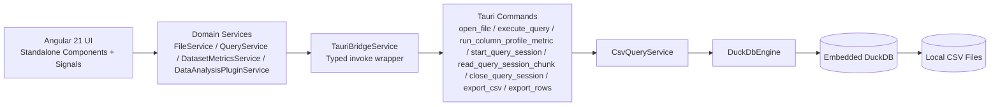

# Architecture: Tapir Query

## 1. Product Scope

Tapir Query is a desktop-first, local analytics workbench for CSV exploration.

Core objectives:

- Fast SQL iteration on local files without server dependencies.
- Predictable memory usage through bounded result windows.
- Strict Rust/TypeScript IPC contracts.
- Runtime resilience on constrained Linux desktop environments.

## 2. Runtime Topology



## 3. Backend Architecture (Rust + Tauri + DuckDB)

### 3.1 Module Layout

```text
src-tauri/src/
  commands/
    csv_commands.rs
  domain/
    csv_query_service.rs
  engine/
    duckdb_engine.rs
    sql_builder.rs
    mod.rs
  error.rs
  lib.rs
```

### 3.2 Responsibility Split

- `lib.rs`
  - Initializes tracing once.
  - Builds Tauri app and registers command handlers.
  - Provides shared `AppState` with `Arc<CsvQueryService>`.

- `commands/csv_commands.rs`
  - Tauri command boundary and DTO mapping.
  - Uses `tauri::State<AppState>` for service access.
  - Offloads blocking work to `spawn_blocking`.
  - Includes `run_column_profile_metric` for exact per-column profiling jobs.

- `domain/csv_query_service.rs`
  - Orchestration between command layer and engine.
  - Owns table registry with `Mutex<HashMap<String, RegisteredCsv>>`.
  - Clears sessions when replacing active file.

- `engine/duckdb_engine.rs`
  - Concrete `CsvQueryEngine` implementation.
  - Executes SQL, schema inspection, paging, export, session storage, and exact column profiling metrics.

- `error.rs`
  - Typed app error taxonomy: `Validation`, `Io`, `Sql`, `State`.

### 3.3 State and Resource Strategy

- Global app state is a single `AppState` managed by Tauri.
- CSV registry is in service state (`Mutex<HashMap<...>>`).
- Query sessions are stored in engine state (`Mutex<HashMap<session_id, QuerySessionState>>`).
- DuckDB connection model: one in-memory `Connection` per operation.
  - Active registered views are recreated into each operation context.
  - Avoids cross-request connection reuse hazards.

### 3.4 Error Handling Pattern

- Internal layers return `AppResult<T>` / `EngineResult<T>`.
- Command layer maps errors to user-facing strings.
- Join failures from `spawn_blocking` are mapped to `State` errors with context.

### 3.5 Command Surface

- `open_file`
- `execute_query`
- `run_column_profile_metric`
- `start_query_session`
- `read_query_session_chunk`
- `close_query_session`
- `export_csv`
- `export_rows`

All command handlers are async wrappers around blocking work.

## 4. Frontend Architecture (Angular 21 + Signals)

### 4.1 Module Layout

```text
src/app/
  domain/
    file.service.ts
    query.service.ts
    dataset-metrics.service.ts
    data-analysis-plugin.service.ts
    ingestion.service.ts
    sql-generator.service.ts
  infrastructure/
    tauri-bridge.service.ts
    tauri-contracts.ts
    error-parsing.service.ts
    layout-state.service.ts
    log.service.ts
    perf.service.ts
    theme.service.ts
  features/
    data-analysis-dashboard/
    drag-drop/
    file-picker/
    sql-editor/
    data-table/
    schema-sidebar/
    query-error-panel/
    settings-panel/
    cheat-sheet/
  app.component.*
```

### 4.2 Service Ownership

- `FileService`
  - Current file path, table name, schema, and file size metadata.

- `QueryService`
  - Query text, result rows/columns, status messaging, query errors, history, sort state.
  - Owns request token invalidation, load hints, viewport prefetch flow, and export triggers.

- `DatasetMetricsService`
  - Optional background filtered and total count queries.
  - Disabled in Tauri runtime as runtime incident mitigation.

- `LayoutStateService`
  - Empty vs loaded layout mode.
  - Cheat-sheet and on-demand analysis panel state.
  - Columns sidebar is coupled to analysis mode and shown only while analysis is open.

- `DataAnalysisPluginService`
  - Isolated plugin state machine for background profiling.
  - Profiles only columns that the user drags from the Columns sidebar into the analysis drop zone.
  - No profiling run starts until at least one column is dropped.
  - Reuses already computed metrics for retained columns when charts are added/removed.
  - Incrementally resolves per-column metric cards (completeness, cardinality, string length).
  - Uses request-token cancellation so stale runs cannot overwrite active UI state.

- `ThemeService`
  - Theme selection (`Light`, `Dark`, `Dark 2026`, `Night Owl`) and settings panel state.
  - Persists active theme in local storage with legacy value migration.

### 4.3 UI Composition

- Empty mode
  - Drag-and-drop zone.
  - Native file picker CTA.

- Loaded mode (base four-zone layout)
  - Zone A: action bar (file pill, SQL editor, execute/export).
  - Zone B: Columns sidebar (visible only in analysis mode; drag source for analysis charts).
  - Zone C: data area.
    - Default: data table with overlays and virtualization.
    - Analysis mode: split-view with top analysis dashboard drop zone and bottom data table.
      - Vertical split ratio is user-resizable via drag handle and persisted locally.
      - Initial state: instructional empty drop area (no charts rendered).
      - After drop: charts render for each dropped column (one card per column).
  - Zone D: status bar (query status, row status, elapsed time).

## 5. Query Execution Modes

### 5.1 Active Mode: Direct Query Execution

Current primary runtime path:

- `QueryService` open/run/sort flows call `execute_query` directly.
- First page is fetched with bounded `limit` and `offset`.
- `effectiveSql` stores the exact SQL used for the shown result.

Why this mode is active:

- Reliability mitigation during runtime hang investigations.

### 5.2 Implemented but Non-Primary: Session Streaming

Implemented backend + frontend methods remain:

- `start_query_session`
- `read_query_session_chunk`
- `close_query_session`

Current status:

- Session streaming orchestration exists in `QueryService` but is not the default call path for open/run/sort.
- Streaming remains available as fallback-capable logic and for targeted diagnostics.

## 6. IPC Contracts and Type Mapping

### 6.1 Naming Rules

- Rust DTO fields are snake_case.
- Rust DTO serialization uses `#[serde(rename_all = "camelCase")]`.
- TypeScript contracts are camelCase.

### 6.2 Contract Characteristics

- Query rows cross IPC as `Record<string, string | null>`.
- Backend normalizes projection cells to `VARCHAR` or null.
- Pagination fields: `limit`, `offset`, `nextOffset`.
- Timing field: `elapsedMs`.
- Profiling contracts include:
  - Metric discriminator (`cardinalityTopValues`, `completenessAudit`, `stringLengthHistogram`).
  - Incremental single-metric payloads per column.
  - Exact full-dataset aggregates and histogram buckets.

### 6.3 Bridge Layer

- `TauriBridgeService` wraps all command invocations.
- Adds per-command perf timers and structured logs.
- Centralized error extraction for unknown invoke failures.

## 7. Memory and Lifecycle Model

### 7.1 Frontend

- Native drag-drop listener is attached once and unlistened in `AppComponent.ngOnDestroy`.
- CodeMirror editor instance and effects are destroyed in `SqlEditorComponent.ngOnDestroy`.
- `LogService` keeps a bounded in-memory ring (max 500 entries).
- Query slow-load timer and metrics refresh timer are explicitly cleared.
- Analysis plugin run state is request-token guarded and cancelled when panel closes.

### 7.2 Backend

- CSV registry and session maps are mutex-protected.
- Sessions are cleared when a new file is opened.
- Session lifecycle supports explicit close and global clear.
- No hard TTL/cap for session map yet.

## 8. Security Architecture

### 8.1 Tauri Capabilities

Current capability (`capabilities/default.json`) grants:

- `core:default`
- `dialog:default`
- `opener:default`

This is functional but not strict least privilege.

### 8.2 CSP

- `tauri.conf.json` currently has `app.security.csp = null`.
- This disables CSP enforcement and should be hardened for production builds.

### 8.3 Command Trust Boundary

- Frontend may pass file and output paths to backend commands.
- Backend validates basic state and I/O errors, but does not enforce path policy constraints beyond filesystem permissions.

## 9. Performance Characteristics

### 9.1 Existing Optimizations

- Per-operation DuckDB connections avoid unstable cross-request reuse.
- `read_csv_auto` uses bounded `SAMPLE_SIZE=20000`.
- UI table rendering uses virtual scrolling.
- Dynamic imports are used for some Tauri-only browser APIs.
- Analysis profiling is queued with bounded frontend concurrency and async IPC jobs.
- Analysis profiling is demand-driven and starts only after a column is dropped into the analysis area.
- Existing column metrics are reused; only newly dropped columns enqueue new profiling tasks.
- Profiling timings are tracked separately (`analysisBatch`, `analysisProfile`, `analysisRoundTrip`).

### 9.2 Known Trade-offs

- Opening a new DuckDB connection per operation favors stability over raw throughput.
- Background count queries are disabled on Tauri runtime to reduce watchdog crash pressure.

## 10. Build and Runtime Operations

### 10.1 Build Snapshot

- Frontend production build succeeds with CSS budget warnings on:
  - `app.component.css`
  - `data-table.component.css`
- Backend `cargo check` succeeds without warnings.

### 10.2 Dev Runtime Constraint

- `tauri dev` currently fails config validation if `productName` contains reserved filename characters (for example `:`).

### 10.3 Platform Targets

- Desktop-focused packaging and release workflow.
- Current release artifacts: Windows NSIS `.exe` and Linux `.deb`.

## 11. Architectural Risks and Next Actions

Priority actions:

1. Make `productName` config-valid to restore dev runtime boot.
2. Tighten capabilities to least privilege (especially opener/core scope).
3. Define production CSP.
4. Decide streaming policy:
   - remove dormant path, or
   - feature-flag and keep actively tested.
5. Add session TTL/cap and query cancellation strategy.

This reflects the current implemented architecture as of April 30, 2026, including the active direct execution mode.
